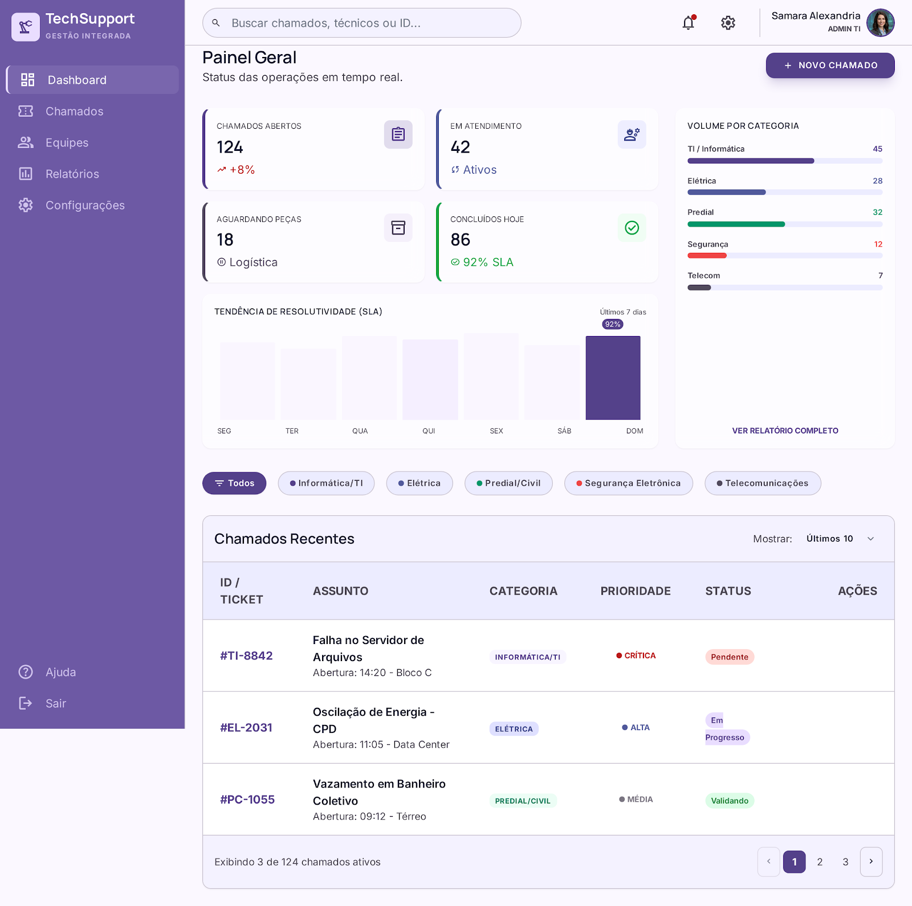

<h1 align="center">
  
  <br/>
  TechSupport — Gestão Integrada de Suporte Técnico
</h1>

<p align="center">
  <strong>Dashboard front-end para gerenciamento de chamados técnicos, equipes e relatórios operacionais.</strong>
</p>

<p align="center">
  
  
  
  
</p>

---

## 📋 Sobre o Projeto

O **TechSupport** é um dashboard de gestão de suporte técnico desenvolvido com HTML, CSS e JavaScript puros (sem frameworks ou dependências externas). Permite que equipes de TI e operações gerenciem chamados técnicos, monitorem indicadores de desempenho e acompanhem SLA em tempo real.

## ✨ Funcionalidades

- **Dashboard** — Métricas em tempo real: chamados abertos, em atendimento, aguardando peças e concluídos
- **Gestão de Chamados** — Tabela com filtro por categoria, busca, paginação e abertura de novos chamados
- **Equipes** — Visualização e cadastro de técnicos por especialidade
- **Relatórios** — Desempenho por técnico e volume por categoria
- **Configurações** — Perfil do administrador, SLA configurável e modo escuro (com persistência via `localStorage`)
- **Responsivo** — Layout adaptado para desktop e mobile com sidebar hamburguer

## 🚀 Como Executar

Este projeto é 100% front-end estático. Não requer instalação de dependências.

### Opção 1 — Abrir direto no navegador
```bash
# Abra o arquivo index.html no seu navegador preferido
start index.html          # Windows
open index.html           # macOS
xdg-open index.html       # Linux
```

### Opção 2 — Servidor local (recomendado para desenvolvimento)
```bash
# Com Python (geralmente já instalado)
python -m http.server 8080

# Com Node.js (npx serve)
npx serve .

# Com VS Code: instale a extensão "Live Server" e clique em "Go Live"
```

Acesse: `http://localhost:8080`

## 📁 Estrutura de Arquivos

```
08 - Suporte Tecnico/
├── index.html          # Página principal (SPA)
├── css/
│   ├── styles.css      # Estilos principais
│   └── variables.css   # Design tokens (cores, espaçamentos, tipografia)
├── js/
│   └── app.js          # Lógica da aplicação
├── screen.png          # Captura de tela do projeto
├── DESIGN.md           # Documentação de design
├── .gitignore          # Arquivos ignorados pelo Git
└── README.md           # Este arquivo
```

## 🎨 Stack Tecnológica

| Tecnologia | Uso |
|---|---|
| HTML5 Semântico | Estrutura e acessibilidade |
| CSS3 + Custom Properties | Design system com variáveis (modo claro/escuro) |
| Vanilla JavaScript (ES6+) | Lógica SPA, eventos, renderização dinâmica |
| Google Fonts (Inter + Manrope) | Tipografia |
| Material Symbols (Google) | Ícones |

## ⚙️ Variáveis de Ambiente

Este projeto **não utiliza variáveis de ambiente** no estado atual, pois é um front-end estático com dados simulados.

Caso no futuro seja integrado a uma API ou backend, crie um arquivo `.env` seguindo o modelo abaixo:

```env
# .env.example — Copie para .env e preencha com seus valores reais
# NUNCA commite o arquivo .env no repositório!

API_BASE_URL=https://api.seudominio.com
API_KEY=sua_chave_aqui
```

> ⚠️ O arquivo `.env` já está incluído no `.gitignore` e **nunca** será enviado ao GitHub.

## 🔒 Segurança

- ✅ Nenhuma API key ou segredo hardcoded no código
- ✅ Todos os dados são simulados em memória (sem banco de dados)
- ✅ Arquivos sensíveis protegidos via `.gitignore`
- ⚠️ O avatar de usuário usa uma URL externa do Google CDN (linha 97 do `index.html`). Considere substituir por um asset local em produção.

## 🤝 Contribuindo

1. Faça um fork do repositório
2. Crie uma branch para sua feature: `git checkout -b feature/minha-feature`
3. Commit suas mudanças: `git commit -m 'feat: adiciona minha feature'`
4. Push para a branch: `git push origin feature/minha-feature`
5. Abra um Pull Request

## 📄 Licença

Este projeto está licenciado sob a [MIT License](LICENSE).

---

<p align="center">
  Desenvolvido por <strong>Samara Alexandria</strong> · 2026
</p>
